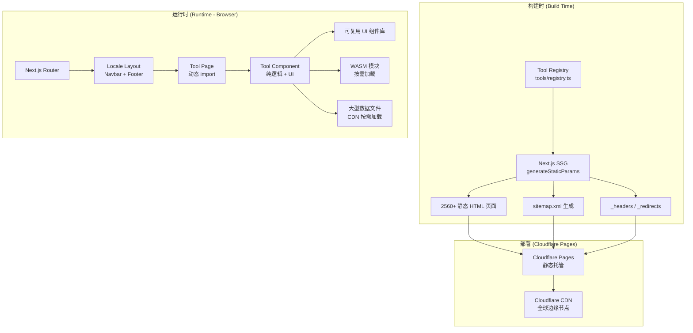
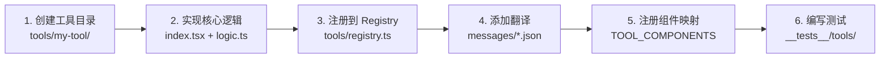

# 设计文档：Web Tools Hub 扩展

## 概述

Web Tools Hub 是一个基于 Next.js 15 + next-intl 的多语言在线工具集合平台，采用纯静态导出（`output: 'export'`）部署到 Cloudflare Pages。当前已有 2 个工具（JSON Formatter、Word Counter），需要扩展至约 256 个独立工具，支持 10 种语言，覆盖 11 个分类。

本设计文档聚焦于：
1. 工具注册表架构扩展（新增 4 个分类：converter、formatter、image、css）
2. 工具组件开发模式与约定
3. 静态生成策略（256 工具 × 10 语言 = 2560 页面）
4. Cloudflare Pages 部署适配
5. SEO/GEO 实现方案
6. 大文件/WASM 按需加载策略
7. 构建优化策略
8. 可复用 UI 组件设计

### 设计原则

- **渐进式扩展**：在现有架构基础上扩展，不破坏已有功能
- **约定优于配置**：工具开发遵循统一模式，降低新增工具的成本
- **纯前端运行**：所有工具逻辑在浏览器端完成，不依赖后端服务
- **构建时优化**：利用 SSG + 代码分割确保性能不随工具数量线性退化

---

## 架构

### 整体架构图



### 工具开发流程



### 关键架构决策

| 决策 | 选择 | 理由 |
|------|------|------|
| 工具组件加载 | `next/dynamic` 懒加载 | 避免首页 bundle 包含所有工具代码 |
| 注册表存储 | 单文件 TypeScript 数组 | 构建时类型安全，运行时零开销 |
| 翻译文件 | 按语言拆分 JSON | next-intl 原生支持，按需加载 |
| WASM 加载 | CDN 外部加载 | 避免构建产物膨胀，绕过 CF Pages 文件限制 |
| 大型数据 | 独立 JSON/数据文件 + CDN | 按需加载，不打包到主 bundle |
| SEO 元数据 | 构建时生成 | SSG 模式下 metadata 在服务端渲染 |

---

## 组件与接口

### 1. 工具注册表扩展

当前 `ToolCategory` 类型仅有 7 个分类，需扩展为 11 个：

```typescript
// tools/registry.ts
export type ToolCategory =
  | 'text'       // 文字处理
  | 'json'       // JSON 工具
  | 'encoding'   // 编码加密
  | 'color'      // 颜色工具
  | 'network'    // 网络工具
  | 'math'       // 数学工具
  | 'converter'  // 格式转换
  | 'formatter'  // 代码格式化
  | 'image'      // 图片处理
  | 'css'        // 前端/CSS 工具
  | 'misc';      // 其他工具
```

注册表接口保持不变，新增工具只需向 `TOOL_REGISTRY` 数组追加条目：

```typescript
export interface ToolMeta {
  slug: string;                          // URL 标识符，如 'base64-encoder'
  icon: string;                          // emoji 或文字图标
  category: ToolCategory;                // 分类
  enabled: boolean;                      // 启用/禁用
  featured?: boolean;                    // 推荐标记
  supportedLocales: Locale[];            // 支持的语言列表
  name: Record<Locale, string>;          // 多语言名称
  description: Record<Locale, string>;   // 多语言描述
}
```

### 2. 工具组件开发约定

每个工具遵循统一的目录结构：

```
tools/
  {tool-slug}/
    index.tsx          # 默认导出的 React 组件（UI + 交互）
    logic.ts           # 可选：纯函数核心逻辑（便于单元测试）
    types.ts           # 可选：工具特有的类型定义
```

工具组件接口：

```typescript
interface ToolComponentProps {
  locale: string;
  toolMeta: ToolMeta;
}
```

核心逻辑与 UI 分离原则：
- `logic.ts` 导出纯函数，不依赖 React/DOM，便于 property-based testing
- `index.tsx` 负责 UI 渲染和状态管理，调用 `logic.ts` 中的函数

### 3. 工具组件动态加载

当前 `TOOL_COMPONENTS` 是静态 import 映射，256 个工具会导致首页 bundle 过大。改为 `next/dynamic` 懒加载：

```typescript
// app/[locale]/tools/[slug]/page.tsx
import dynamic from 'next/dynamic';

// 动态组件映射 - 按需加载
const TOOL_COMPONENTS: Record<string, React.ComponentType<ToolComponentProps>> = {};

function getToolComponent(slug: string) {
  return dynamic(() => import(`@/tools/${slug}/index`), {
    loading: () => <ToolSkeleton />,
    ssr: true,  // SSG 需要 ssr: true
  });
}
```

注意：由于 `output: 'export'` 模式下 `next/dynamic` 的 `ssr: true` 会在构建时预渲染，运行时仍然按需加载 JS chunk。

### 4. 可复用 UI 组件库扩展

在现有组件基础上新增：

```typescript
// 现有组件
Button, CopyButton, Input, Textarea, ToolCard, ToolLayout

// 新增组件
Select          // 下拉选择器（单选/多选）
Tabs            // 标签页切换
ColorPicker     // 颜色选择器
FileDropzone    // 文件拖拽上传区域
Slider          // 滑块控件
Toggle          // 开关切换
CodeEditor      // 代码编辑器（基于 textarea + 语法高亮）
ProgressBar     // 进度条
StatCard        // 统计数据卡片
DiffViewer      // 代码对比查看器
```

组件设计原则：
- 所有交互元素最小点击区域 44×44px
- 支持 `aria-*` 属性和键盘操作
- 通过 `className` prop 支持样式覆盖
- 使用 Tailwind CSS 实现样式

### 5. SEO 组件

```typescript
// components/seo/ToolJsonLd.tsx
// 为每个工具页面生成 JSON-LD 结构化数据（WebApplication 类型）

// components/seo/HreflangTags.tsx
// 生成 hreflang 标签集，标明所有语言版本的替代 URL

// components/seo/OpenGraphMeta.tsx
// 生成 Open Graph 和 Twitter Card meta 标签
```

### 6. 构建时脚本

```typescript
// scripts/generate-sitemap.ts
// 构建后生成 sitemap.xml，包含所有 locale × tool 的 URL 及 xhtml:link

// scripts/generate-headers.ts
// 生成 Cloudflare Pages 的 _headers 文件（缓存策略 + 安全头）

// scripts/generate-redirects.ts
// 生成 _redirects 文件（根路径重定向、无 locale 前缀重定向）

// scripts/check-cf-limits.ts
// CI 检查：文件数量 < 20000，单文件 < 25MB
```

### 7. 翻译文件结构

当前所有翻译在单个 JSON 文件中。随着工具增多，需要拆分：

```
messages/
  en.json           # 公共翻译 + 工具翻译（保持现有结构）
  zh-cn.json
  ...
```

翻译键命名约定：
```json
{
  "tools": {
    "{tool-slug}": {
      "input_placeholder": "...",
      "output_label": "...",
      "action_button": "...",
      "error_message": "...",
      "instructions": "..."
    }
  },
  "categories": {
    "converter": "Format Converter",
    "formatter": "Code Formatter",
    "image": "Image Tools",
    "css": "CSS Tools"
  }
}
```

---

## 数据模型

### 核心类型定义

```typescript
// tools/registry.ts - 扩展后的完整类型

export type ToolCategory =
  | 'text' | 'json' | 'encoding' | 'color' | 'network'
  | 'math' | 'converter' | 'formatter' | 'image' | 'css' | 'misc';

export type Locale =
  | 'en' | 'zh-cn' | 'zh-tw' | 'ja' | 'ko'
  | 'es' | 'fr' | 'de' | 'pt' | 'ru';

export interface ToolMeta {
  slug: string;
  icon: string;
  category: ToolCategory;
  enabled: boolean;
  featured?: boolean;
  supportedLocales: Locale[];
  name: Record<Locale, string>;
  description: Record<Locale, string>;
}
```

### SEO 数据模型

```typescript
// lib/seo.ts

export interface ToolSeoData {
  title: string;                    // "{工具名称} - {分类} | Web Tools Hub"
  description: string;              // 工具的多语言描述
  canonicalUrl: string;             // 当前语言版本的 canonical URL
  hreflangUrls: HreflangEntry[];   // 所有语言版本的 URL
  jsonLd: WebApplicationJsonLd;     // JSON-LD 结构化数据
  ogMeta: OpenGraphMeta;            // Open Graph 标签
  twitterMeta: TwitterCardMeta;     // Twitter Card 标签
}

export interface HreflangEntry {
  locale: string;     // 如 'en', 'zh-CN'
  href: string;       // 完整 URL
}

export interface WebApplicationJsonLd {
  '@context': 'https://schema.org';
  '@type': 'WebApplication';
  name: string;
  description: string;
  url: string;
  applicationCategory: string;
  operatingSystem: 'Any';
  offers: { '@type': 'Offer'; price: '0'; priceCurrency: 'USD' };
}

export interface OpenGraphMeta {
  'og:title': string;
  'og:description': string;
  'og:type': string;
  'og:url': string;
  'og:locale': string;
}

export interface TwitterCardMeta {
  'twitter:card': 'summary';
  'twitter:title': string;
  'twitter:description': string;
}
```

### Cloudflare Pages 配置数据

```typescript
// lib/cf-config.ts

export interface CfPagesConfig {
  siteUrl: string;          // NEXT_PUBLIC_SITE_URL
  maxFiles: 20000;          // CF Pages 免费版文件数限制
  maxFileSize: 25 * 1024 * 1024;  // 25MB 单文件限制
  buildTimeout: 20 * 60;   // 20 分钟构建超时
}

export interface CacheHeaders {
  staticAssets: 'public, max-age=31536000, immutable';
  htmlPages: 'public, max-age=0, must-revalidate';
  wasmFiles: 'public, max-age=31536000, immutable';
}
```

### 构建产物文件数量估算

| 类型 | 数量 | 计算方式 |
|------|------|----------|
| 工具页面 HTML | ~2560 | 256 工具 × 10 语言 |
| 分类页面 HTML | ~110 | 11 分类 × 10 语言 |
| 首页 HTML | 10 | 10 语言 |
| 404 页面 | 10 | 10 语言 |
| JS chunks | ~300 | 256 工具 chunk + 公共 chunk |
| CSS 文件 | ~5 | Tailwind 输出 |
| 其他静态文件 | ~20 | sitemap, robots, _headers 等 |
| **总计** | **~3015** | 远低于 20000 限制 |


---

## 正确性属性 (Correctness Properties)

*正确性属性是一种在系统所有合法执行中都应成立的特征或行为——本质上是对系统应做什么的形式化陈述。属性是人类可读规格说明与机器可验证正确性保证之间的桥梁。*

### Property 1: 注册表条目结构完整性

*For all* ToolMeta 条目，每个条目必须包含非空的 slug、icon、category，且对于其 supportedLocales 中的每种语言，name 和 description 都必须是非空字符串。所有字段必须是原始类型（string、boolean、array），不包含函数或 Promise。

**Validates: Requirements 1.1, 11.3**

### Property 2: 启用/禁用过滤正确性

*For all* ToolMeta 数组，getEnabledTools 返回的结果必须仅包含 enabled === true 的工具，且不遗漏任何已启用的工具。

**Validates: Requirements 1.3**

### Property 3: 重复 slug 检测

*For all* ToolMeta 数组，若存在两个或以上条目具有相同的 slug，则 validateRegistry 必须抛出错误；若所有 slug 唯一，则不抛出错误。

**Validates: Requirements 1.4**

### Property 4: 路由路径格式正确性

*For all* 已启用工具和所有支持的 locale，生成的静态路径必须遵循 `/{locale}/tools/{slug}/` 格式，且 locale 和 slug 值与注册表中的数据一致。

**Validates: Requirements 2.1, 271.2**

### Property 5: 翻译回退正确性

*For all* 翻译键和任意 locale 的消息对象，getTranslationWithFallback 必须返回非空字符串：优先返回当前 locale 的值，若缺失则返回英文值，若英文也缺失则返回键本身。

**Validates: Requirements 6.5**

### Property 6: 搜索引擎包含性

*For all* 已启用工具，以该工具的精确名称作为搜索查询时，搜索结果必须包含该工具。

**Validates: Requirements 8.1**

### Property 7: SEO 元数据完整性

*For all* 已启用工具和所有支持的 locale，生成的 SEO 数据必须包含：非空的 title（格式为 "{工具名称} - {分类} | Web Tools Hub"）、非空的 description、有效的 canonical URL、以及包含所有 10 种语言版本的 hreflang 标签集。

**Validates: Requirements 10.1, 10.6, 6.6, 138.2**

### Property 8: JSON-LD 结构化数据完整性

*For all* 已启用工具，生成的 JSON-LD 必须包含 @type: 'WebApplication'、非空的 name、description、url、applicationCategory 字段，以及 operatingSystem: 'Any' 和 offers.price: '0'。

**Validates: Requirements 10.3, 139.1**

### Property 9: Sitemap 覆盖完整性

*For all* 已启用工具和所有支持的 locale，生成的 sitemap.xml 必须包含对应的 URL 条目，且每个条目包含所有语言版本的 xhtml:link。

**Validates: Requirements 10.4, 138.4, 278.1**

### Property 10: JSON 格式化 round-trip

*For all* 合法 JSON 值，将其序列化后经过 formatJson 格式化，再解析回来，必须与原始值语义等价。

**Validates: Requirements 14.1, 16.4**

### Property 11: 编码解码 round-trip（通用模式）

*For all* 合法输入文本，以下编码/解码操作的 round-trip 必须产生与原始输入相同的结果：
- Base64 编码/解码 (Requirements 26.3)
- URL 编码/解码 (Requirements 29.4)
- Unicode 转义/反转义 (Requirements 30.3)
- Escape 编码/解码 (Requirements 32.3)
- Base32/Base58/Base62 编码/解码 (Requirements 33.3)
- Gzip 压缩/解压 (Requirements 36.4)
- NATIVE/ASCII 互转 (Requirements 41.3)
- HTML 转义/反转义 (Requirements 148.3)
- UTF-8 编码/解码 (Requirements 163.3)

**Validates: Requirements 26.3, 29.4, 30.3, 32.3, 33.3, 36.4, 41.3, 148.3, 163.3**

### Property 12: 加密解密 round-trip

*For all* 明文和密钥组合，对称加密（AES/DES/3DES/RC4/Rabbit）后再解密必须产生与原始明文相同的结果。同样，RSA 公钥加密后用私钥解密必须产生与原始明文相同的结果。

**Validates: Requirements 28.5, 42.5**

### Property 13: 格式互转 round-trip

*For all* 合法输入数据，以下格式转换的 round-trip 必须产生与原始数据等价的结果：
- JSON → YAML → JSON (Requirements 18.4)
- JSON → XML → JSON (Requirements 18.5)
- JSON → 查询字符串 → JSON（扁平对象）(Requirements 21.3)
- 时间戳 → 日期 → 时间戳 (Requirements 51.6)
- 文本 → 十六进制 → 文本 (Requirements 53.4)
- HEX → RGB → HEX (Requirements 55.6)
- 全角 → 半角 → 全角 (Requirements 61.3)
- 文本 → 摩斯密码 → 文本 (Requirements 35.4)
- 二维码生成 → 解码 (Requirements 56.5)
- IP → Int → IP (Requirements 175.3)

**Validates: Requirements 18.4, 18.5, 21.3, 51.6, 53.4, 55.6, 61.3, 35.4, 56.5, 175.3**

### Property 14: 哈希幂等性

*For all* 输入文本和哈希算法，对同一输入计算两次哈希值必须产生完全相同的结果。

**Validates: Requirements 27.5**

### Property 15: 文本逆序 involution

*For all* 合法文本（包括 Unicode 和 emoji），对文本执行两次逆序操作必须产生与原始文本相同的结果。

**Validates: Requirements 67.4**

### Property 16: JSON 排序值保持不变

*For all* 合法 JSON 对象，对键进行排序后，所有值的集合必须与排序前完全相同（仅键的顺序改变）。

**Validates: Requirements 17.4**

### Property 17: XML 格式化/压缩语义等价

*For all* 合法 XML 输入，格式化后再压缩必须保持 XML 的语义等价性（解析后的 DOM 结构相同）。

**Validates: Requirements 46.4**

---

## 错误处理

### 错误处理策略

| 场景 | 处理方式 | 用户反馈 |
|------|----------|----------|
| 工具输入格式错误 | 捕获解析异常，返回 error 对象 | 显示红色错误提示，包含错误位置信息 |
| 工具页面 JS 加载失败 | ToolErrorBoundary 捕获 | 显示"工具加载失败"提示 + 重试按钮 |
| 翻译键缺失 | getTranslationWithFallback 回退 | 显示英文文本或键名 |
| 不存在的工具路径 | notFound() | 显示 404 页面 |
| 文件上传超大 | 前端校验文件大小 | 显示文件大小限制提示 |
| WASM 加载失败 | try/catch + 降级方案 | 提示用户刷新或使用替代方案 |
| 浏览器 API 不支持 | 特性检测 | 显示浏览器兼容性提示 |

### 工具级错误处理约定

每个工具的核心逻辑函数（`logic.ts`）应返回 Result 类型：

```typescript
interface ToolResult<T> {
  output?: T;
  error?: string;
}
```

- 纯函数不抛出异常，通过返回值传递错误
- UI 层根据 error 字段显示错误提示（使用 `role="alert"` 和 `aria-live`）
- 已有的 `ToolErrorBoundary` 作为最后防线捕获未预期的渲染错误

### Cloudflare Pages 特定错误处理

- 404 页面：构建时生成多语言 `404.html`，CF Pages 自动使用
- 大文件处理：前端校验文件大小，超过限制时提示用户
- WASM 加载：设置超时和重试机制，CDN 不可用时显示降级提示

---

## 测试策略

### 双重测试方法

本项目采用单元测试 + 属性测试的双重策略：

- **单元测试 (Unit Tests)**：验证具体示例、边界情况和错误条件
- **属性测试 (Property-Based Tests)**：验证跨所有输入的通用属性

两者互补：单元测试捕获具体 bug，属性测试验证通用正确性。

### 测试工具链

- **测试框架**：Vitest（已配置）
- **属性测试库**：fast-check（已安装）
- **DOM 测试**：@testing-library/react + jsdom（已配置）

### 属性测试配置

- 每个属性测试最少运行 **100 次迭代**
- 每个属性测试必须以注释引用设计文档中的属性编号
- 标签格式：`Feature: web-tools-hub, Property {number}: {property_text}`
- 每个正确性属性由**单个**属性测试实现

### 测试文件组织

```
__tests__/
  registry.test.ts          # Property 1-4: 注册表相关属性
  seo.test.ts               # Property 7-9: SEO 相关属性
  search.test.ts            # Property 6: 搜索引擎属性
  i18n.test.ts              # Property 5: 翻译回退属性
  tools/
    json-formatter.test.ts  # Property 10: JSON round-trip
    base64.test.ts          # Property 11: Base64 round-trip
    url-encoder.test.ts     # Property 11: URL 编码 round-trip
    hash.test.ts            # Property 14: 哈希幂等性
    ...                     # 每个工具一个测试文件
```

### 测试覆盖重点

| 属性类别 | 测试方式 | 优先级 |
|----------|----------|--------|
| 注册表完整性 (P1-P4) | 属性测试 | P0 |
| 翻译回退 (P5) | 属性测试 | P0 |
| 搜索包含性 (P6) | 属性测试 | P0 |
| SEO 完整性 (P7-P9) | 属性测试 + 单元测试 | P0 |
| 编码 round-trip (P10-P13) | 属性测试 | 随工具实现 |
| 哈希幂等性 (P14) | 属性测试 | 随工具实现 |
| 文本操作 (P15-P16) | 属性测试 | 随工具实现 |
| UI 组件渲染 | 单元测试 | P1 |
| 构建产物检查 | CI 脚本 | P0 |

### 单元测试重点

- 每个工具的边界情况（空输入、超大输入、特殊字符）
- 错误输入的错误提示正确性
- UI 组件的可访问性属性（aria-*）
- Cloudflare Pages 限制检查（文件数、文件大小）
