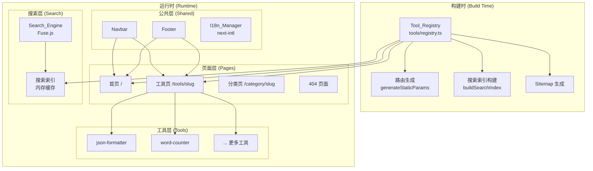
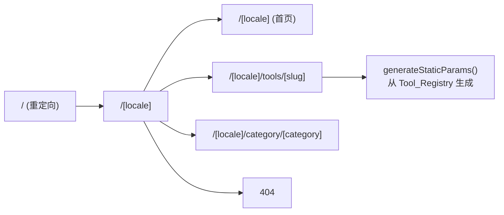

# 技术设计文档：Web Tools Hub

## 概述

Web Tools Hub 是一个高度可扩展的 Web 工具聚合平台，目标是支持成千上万个独立工具页面。平台采用现代前端框架构建，具备以下核心特征：

- **桌面优先响应式设计**：优先保障桌面端体验，向下适配平板与移动端
- **多语言国际化**：支持 10 种语言，浏览器语言自动检测
- **零配置扩展**：新增工具只需在 Tool_Registry 添加一条配置
- **性能优先**：代码分割 + 懒加载，首屏 bundle 不随工具数量增长
- **SEO 友好**：支持 SSG/SSR，自动生成 meta 标签

### 技术选型

| 层次 | 技术 |
|------|------|
| 框架 | Next.js 14（App Router，支持 SSG/SSR） |
| 语言 | TypeScript |
| 样式 | Tailwind CSS（desktop-first 断点） |
| 国际化 | next-intl |
| 搜索 | Fuse.js（客户端模糊搜索） |
| 状态管理 | React Context + useState（轻量，无需 Redux） |
| 测试 | Vitest + fast-check（属性测试） |

**选型理由：**
- Next.js App Router 原生支持 SSG/SSR，动态路由 `[slug]` 天然匹配工具路由需求
- next-intl 与 App Router 深度集成，支持服务端/客户端双端翻译
- Fuse.js 轻量（~24KB），纯客户端运行，无需后端接口
- fast-check 是 TypeScript 生态最成熟的属性测试库

---

## 架构

### 整体架构图



### 目录结构

```
web-tools-hub/
├── app/                          # Next.js App Router
│   ├── [locale]/                 # 语言前缀路由
│   │   ├── layout.tsx            # 根布局（Navbar + Footer）
│   │   ├── page.tsx              # 首页
│   │   ├── tools/
│   │   │   └── [slug]/
│   │   │       └── page.tsx      # 工具页（动态路由）
│   │   └── category/
│   │       └── [category]/
│   │           └── page.tsx      # 分类页
│   └── not-found.tsx             # 404 页面
├── tools/
│   ├── registry.ts               # Tool_Registry（核心配置）
│   ├── json-formatter/
│   │   └── index.tsx             # JSON 格式化工具组件
│   └── word-counter/
│       └── index.tsx             # 字符统计工具组件
├── components/
│   ├── layout/
│   │   ├── Navbar.tsx
│   │   └── Footer.tsx
│   └── ui/                       # 可复用 UI 组件库
│       ├── Button.tsx
│       ├── Input.tsx
│       ├── Textarea.tsx
│       ├── CopyButton.tsx
│       └── ToolLayout.tsx        # 工具页面标准模板
├── lib/
│   ├── search.ts                 # Search_Engine（Fuse.js 封装）
│   └── i18n.ts                   # I18n 工具函数
├── messages/                     # 语言包
│   ├── en.json
│   ├── zh-CN.json
│   ├── zh-TW.json
│   ├── ja.json
│   ├── ko.json
│   ├── es.json
│   ├── fr.json
│   ├── de.json
│   ├── pt.json
│   └── ru.json
└── i18n.ts                       # next-intl 配置
```

### 路由架构



所有路由均带语言前缀（如 `/en/tools/json-formatter`、`/zh-CN/tools/json-formatter`），根路径 `/` 根据浏览器语言自动重定向。

---

## 组件与接口

### Tool_Registry 接口

```typescript
// tools/registry.ts

export interface ToolMeta {
  slug: string;                    // 唯一标识符，用于路由
  icon: string;                    // 图标（emoji 或 SVG 路径）
  category: ToolCategory;          // 所属分类
  enabled: boolean;                // 启用/禁用
  featured?: boolean;              // 是否为推荐工具
  supportedLocales: Locale[];      // 支持的语言列表
  // 多语言名称和描述
  name: Record<Locale, string>;
  description: Record<Locale, string>;
}

export type ToolCategory =
  | 'text'        // 文本处理
  | 'json'        // JSON 工具
  | 'encoding'    // 编码/解码
  | 'color'       // 颜色工具
  | 'network'     // 网络工具
  | 'math'        // 数学计算
  | 'misc';       // 其他

export type Locale = 'en' | 'zh-CN' | 'zh-TW' | 'ja' | 'ko' | 'es' | 'fr' | 'de' | 'pt' | 'ru';

// 注册表主体（纯数据，无运行时逻辑）
export const TOOL_REGISTRY: ToolMeta[] = [
  {
    slug: 'json-formatter',
    icon: '{}',
    category: 'json',
    enabled: true,
    featured: true,
    supportedLocales: ['en', 'zh-CN'],
    name: { en: 'JSON Formatter', 'zh-CN': 'JSON 格式化', ... },
    description: { en: 'Format and validate JSON', 'zh-CN': '格式化并验证 JSON', ... },
  },
  // ... 更多工具
];
```

### Search_Engine 接口

```typescript
// lib/search.ts

export interface SearchResult {
  tool: ToolMeta;
  score: number;   // 相关性分数（0-1，越低越相关）
}

export interface SearchEngine {
  search(query: string): SearchResult[];
  rebuild(tools: ToolMeta[]): void;
}

// 工厂函数，接受当前 locale 以搜索对应语言的名称/描述
export function createSearchEngine(tools: ToolMeta[], locale: Locale): SearchEngine;
```

### I18n_Manager 接口

next-intl 提供的标准接口，关键扩展点：

```typescript
// i18n.ts
export const locales: Locale[] = ['en', 'zh-CN', 'zh-TW', 'ja', 'ko', 'es', 'fr', 'de', 'pt', 'ru'];
export const defaultLocale: Locale = 'en';

// 语言检测优先级：
// 1. URL 前缀（/zh-CN/...）
// 2. localStorage 中的用户偏好
// 3. Accept-Language 请求头
// 4. 默认回退 'en'
```

### 工具组件接口

每个工具组件只需实现核心逻辑，框架自动注入公共布局：

```typescript
// 工具组件约定接口
export interface ToolComponentProps {
  locale: Locale;
  toolMeta: ToolMeta;
}

// 示例：工具组件只需导出一个 React 组件
export default function JsonFormatter({ locale, toolMeta }: ToolComponentProps) {
  // 仅实现工具核心逻辑
}
```

### Navbar 组件接口

```typescript
interface NavbarProps {
  currentLocale: Locale;
  currentPath: string;   // 用于高亮当前导航项
}
```

### ToolLayout 模板接口

```typescript
interface ToolLayoutProps {
  toolMeta: ToolMeta;
  locale: Locale;
  children: React.ReactNode;  // 工具核心内容
  instructions?: React.ReactNode;  // 使用说明（可选）
}
```

---

## 数据模型

### ToolMeta（工具元数据）

```typescript
interface ToolMeta {
  slug: string;                        // 唯一标识，URL 安全字符串
  icon: string;                        // 图标标识
  category: ToolCategory;              // 分类枚举
  enabled: boolean;                    // 是否启用
  featured?: boolean;                  // 是否推荐
  supportedLocales: Locale[];          // 支持语言
  name: Record<Locale, string>;        // 多语言名称
  description: Record<Locale, string>; // 多语言描述
}
```

### 语言包结构（messages/en.json）

```json
{
  "common": {
    "search_placeholder": "Search tools...",
    "no_results": "No tools found",
    "copy": "Copy",
    "copied": "Copied!"
  },
  "navbar": {
    "home": "Home",
    "categories": "Categories"
  },
  "footer": {
    "copyright": "© {year} Web Tools Hub",
    "privacy": "Privacy Policy",
    "terms": "Terms of Service"
  },
  "tools": {
    "json-formatter": {
      "input_placeholder": "Paste your JSON here...",
      "format_button": "Format",
      "error_invalid_json": "Invalid JSON: {message}",
      "instructions": "..."
    },
    "word-counter": {
      "input_placeholder": "Type or paste your text here...",
      "chars": "Characters",
      "words": "Words",
      "lines": "Lines"
    }
  }
}
```

### 搜索索引结构

```typescript
// Fuse.js 索引配置
const fuseOptions: IFuseOptions<ToolMeta> = {
  keys: [
    { name: `name.${locale}`, weight: 0.6 },
    { name: `description.${locale}`, weight: 0.3 },
    { name: 'category', weight: 0.1 },
  ],
  threshold: 0.4,      // 模糊匹配阈值
  includeScore: true,
};
```

### 路由参数模型

```typescript
// Next.js 动态路由参数
interface ToolPageParams {
  locale: Locale;
  slug: string;
}

// generateStaticParams 返回值
type StaticParams = ToolPageParams[];
// 由 Tool_Registry 中所有 enabled=true 的工具 × 所有 locale 生成
```

### 响应式断点模型

```
桌面端（基础）：> 1024px
平板端：768px – 1024px  （Tailwind: lg:）
移动端：< 768px          （Tailwind: md:）
```

Tailwind 配置采用 desktop-first 策略，使用 `max-width` 媒体查询：

```javascript
// tailwind.config.js
screens: {
  'tablet': {'max': '1024px'},
  'mobile': {'max': '768px'},
}
```

---

## 正确性属性

*属性（Property）是在系统所有有效执行中都应成立的特征或行为——本质上是对系统应做什么的形式化陈述。属性是人类可读规范与机器可验证正确性保证之间的桥梁。*

### 属性 1：注册表条目完整性

*对任意* Tool_Registry 中的工具条目，该条目必须包含所有必需字段（slug、name、description、category、icon、enabled、supportedLocales），且每个支持语言的 name 和 description 字段均不为空字符串。

**验证需求：1.1、6.6**

---

### 属性 2：启用工具路由生成

*对任意* Tool_Registry 中 `enabled=true` 的工具，`generateStaticParams()` 的返回值必须包含该工具在所有支持语言下的路由参数（`{ locale, slug }`）。

**验证需求：1.2、11.2**

---

### 属性 3：禁用工具不生成路由

*对任意* Tool_Registry 中 `enabled=false` 的工具，`generateStaticParams()` 的返回值不得包含该工具的任何路由参数。

**验证需求：1.3**

---

### 属性 4：重复 slug 检测

*对任意* 包含至少两条相同 slug 的工具配置数组，注册表验证函数必须抛出错误，而非静默通过。

**验证需求：1.4**

---

### 属性 5：工具路径格式

*对任意* Tool_Registry 中的工具元数据，其生成的路由路径必须严格符合 `/tools/{slug}` 格式，其中 `{slug}` 与元数据中的 slug 字段完全一致。

**验证需求：2.1**

---

### 属性 6：语言检测与偏好回退

*对任意* Accept-Language 请求头字符串，语言检测函数必须返回支持语言列表中最匹配的语言；若无匹配，则返回默认语言 `'en'`。

**验证需求：6.4**

---

### 属性 7：缺失翻译回退英文

*对任意* 翻译键和非英文语言，若该语言包中不存在该键的翻译，I18n_Manager 必须返回英文原文，而非空字符串或翻译键名本身。

**验证需求：6.5**

---

### 属性 8：首页内容过滤正确性

*对任意* Tool_Registry 数据集，首页渲染的工具列表必须仅包含 `enabled=true` 的工具；推荐工具区域必须仅包含 `featured=true` 的工具，且推荐工具必须是启用工具的子集。

**验证需求：7.1、7.3**

---

### 属性 9：搜索结果相关性

*对任意* 搜索查询字符串和工具注册表，搜索引擎返回的所有结果必须在名称、描述或分类字段中与查询存在相关性；空查询应返回所有启用工具。

**验证需求：8.1**

---

### 属性 10：搜索索引与注册表同步

*对任意* Tool_Registry 数据集，调用 `rebuild()` 重建索引后，所有 `enabled=true` 的工具均可通过其名称精确搜索到；`enabled=false` 的工具不应出现在任何搜索结果中。

**验证需求：8.5**

---

### 属性 11：SEO meta 标签生成

*对任意* 工具元数据和语言，工具页面生成的 `<title>` 和 `<meta description>` 内容必须与 Tool_Registry 中该工具对应语言的 name 和 description 字段一致，且均不为空。

**验证需求：9.4**

---

### 属性 12：JSON 格式化 round-trip

*对任意* 合法的 JSON 字符串，经格式化工具处理后，对输出结果执行 `JSON.parse()` 应得到与原始输入语义等价的对象（深度相等）；对任意非法 JSON 字符串，格式化函数必须返回包含错误信息的结果，而非抛出未捕获异常。

**验证需求：10.1**

---

### 属性 13：字符统计正确性

*对任意* 文本字符串，字符统计工具返回的字符数必须等于字符串的 Unicode 字符数，单词数必须等于按连续空白字符分割后非空词的数量，行数必须等于换行符数量加一（空字符串行数为 0）。

**验证需求：10.2**

---

### 属性 14：注册表纯数据性

*对任意* Tool_Registry 中的工具条目，该条目的所有字段值必须为基本类型（string、boolean、string[]、Record<string, string>），不得包含函数、类实例或 Promise 等运行时对象。

**验证需求：11.3**

---

### 属性 15：导航高亮一致性

*对任意* 当前页面路径，Navbar 组件中被标记为"当前激活"的导航项数量必须恰好为 1（或 0，当路径不匹配任何导航项时），不得同时高亮多个导航项。

**验证需求：3.5**

---

## 错误处理

### 构建时错误

| 错误场景 | 处理策略 |
|---------|---------|
| Tool_Registry 中存在重复 slug | 构建阶段抛出错误，终止构建，输出冲突的 slug 名称 |
| 工具组件文件不存在 | Next.js 动态导入失败，构建时报错，提示缺失文件路径 |
| 语言包文件缺失 | 构建时警告，运行时回退英文，不中断构建 |
| 工具元数据字段缺失 | TypeScript 编译时类型检查捕获，构建失败 |

### 运行时错误

| 错误场景 | 处理策略 |
|---------|---------|
| 访问不存在的工具路径 | 展示统一 404 页面，提供返回首页链接 |
| JSON 格式化输入非法 | 在工具操作区内联展示错误信息，不影响页面其他部分 |
| 语言包加载失败 | 回退至英文语言包，控制台输出警告 |
| 搜索索引构建失败 | 降级为空结果，展示"搜索暂不可用"提示 |
| 工具组件运行时异常 | React Error Boundary 捕获，展示工具级错误提示，不影响 Navbar/Footer |

### 错误边界策略

```
App Layout
├── GlobalErrorBoundary（捕获全局未处理错误）
│   ├── Navbar（独立，不受工具错误影响）
│   ├── ToolErrorBoundary（每个工具页面独立边界）
│   │   └── ToolComponent
│   └── Footer（独立，不受工具错误影响）
```

---

## 测试策略

### 双轨测试方法

本项目采用单元测试与属性测试相结合的方式，两者互补：

- **单元测试**：验证具体示例、边缘情况和错误条件
- **属性测试**：通过随机输入验证普遍性属性，覆盖单元测试难以穷举的输入空间

### 属性测试配置

- **测试库**：[fast-check](https://github.com/dubzzz/fast-check)（TypeScript 生态最成熟的属性测试库）
- **最小迭代次数**：每个属性测试运行 **100 次**随机输入
- **标签格式**：每个属性测试必须包含注释标签：
  ```
  // Feature: web-tools-hub, Property {N}: {property_text}
  ```

### 属性测试实现要求

每个正确性属性必须由**一个**属性测试实现：

| 属性 | 测试文件 | fast-check 生成器 |
|------|---------|-----------------|
| P1 注册表条目完整性 | `registry.test.ts` | `fc.record({ slug, name, ... })` |
| P2 启用工具路由生成 | `registry.test.ts` | `fc.array(toolMetaArb)` |
| P3 禁用工具不生成路由 | `registry.test.ts` | `fc.array(toolMetaArb)` |
| P4 重复 slug 检测 | `registry.test.ts` | `fc.array(toolMetaArb, {minLength:2})` |
| P5 工具路径格式 | `router.test.ts` | `fc.record({ slug: fc.string() })` |
| P6 语言检测回退 | `i18n.test.ts` | `fc.string()` (Accept-Language) |
| P7 缺失翻译回退英文 | `i18n.test.ts` | `fc.string()` (translation key) |
| P8 首页内容过滤 | `homepage.test.ts` | `fc.array(toolMetaArb)` |
| P9 搜索结果相关性 | `search.test.ts` | `fc.string()` (query) |
| P10 搜索索引同步 | `search.test.ts` | `fc.array(toolMetaArb)` |
| P11 SEO meta 标签 | `tool-page.test.ts` | `fc.record(toolMetaArb)` |
| P12 JSON 格式化 round-trip | `json-formatter.test.ts` | `fc.jsonValue()` |
| P13 字符统计正确性 | `word-counter.test.ts` | `fc.string()` |
| P14 注册表纯数据性 | `registry.test.ts` | `fc.array(toolMetaArb)` |
| P15 导航高亮一致性 | `navbar.test.ts` | `fc.string()` (path) |

### 单元测试覆盖范围

单元测试聚焦于具体示例和边缘情况，避免与属性测试重复：

- **示例测试**：
  - 2.3：访问不存在路径返回 404
  - 3.2：Navbar 包含 Logo、搜索、语言切换、分类菜单
  - 4.1：Footer 包含版权、隐私政策、使用条款链接
  - 6.1：locales 配置包含全部 10 种语言代码
  - 8.3：搜索无结果时展示提示信息
  - 9.1：ToolLayout 渲染包含标题区、操作区、说明区

- **边缘情况**：
  - 7.4：工具数量 > 50 时分类筛选功能可用
  - JSON 格式化：空字符串输入
  - 字符统计：纯空白字符串、多语言字符（CJK、emoji）

### 测试文件结构

```
__tests__/
├── registry.test.ts       # Tool_Registry 相关属性测试
├── router.test.ts         # 路由生成测试
├── i18n.test.ts           # 国际化属性测试
├── search.test.ts         # 搜索引擎属性测试
├── homepage.test.ts       # 首页内容过滤测试
├── tool-page.test.ts      # 工具页面 SEO 测试
├── navbar.test.ts         # 导航栏测试
└── tools/
    ├── json-formatter.test.ts   # JSON 格式化工具测试
    └── word-counter.test.ts     # 字符统计工具测试
```

### 属性测试示例

```typescript
// Feature: web-tools-hub, Property 12: JSON 格式化 round-trip
import * as fc from 'fast-check';
import { formatJson } from '../tools/json-formatter';

test('P12: JSON 格式化 round-trip', () => {
  fc.assert(
    fc.property(fc.jsonValue(), (value) => {
      const input = JSON.stringify(value);
      const result = formatJson(input);
      expect(result.error).toBeUndefined();
      expect(JSON.parse(result.output!)).toEqual(value);
    }),
    { numRuns: 100 }
  );
});

// Feature: web-tools-hub, Property 13: 字符统计正确性
import { countStats } from '../tools/word-counter';

test('P13: 字符统计正确性', () => {
  fc.assert(
    fc.property(fc.string(), (text) => {
      const stats = countStats(text);
      const expectedChars = [...text].length; // Unicode-aware
      const expectedWords = text.trim() === '' ? 0 : text.trim().split(/\s+/).length;
      const expectedLines = text === '' ? 0 : text.split('\n').length;
      expect(stats.chars).toBe(expectedChars);
      expect(stats.words).toBe(expectedWords);
      expect(stats.lines).toBe(expectedLines);
    }),
    { numRuns: 100 }
  );
});
```
